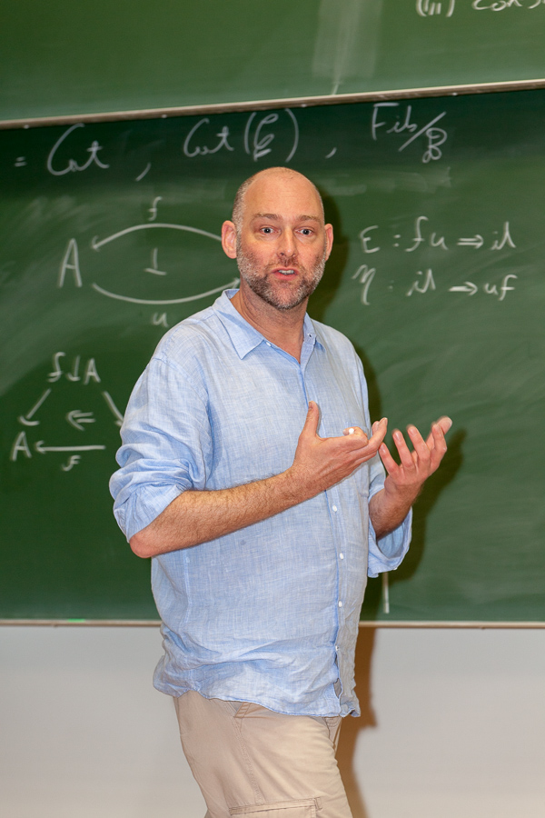

*\"I have the audacity to believe that peoples everywhere can have three meals a day for their bodies, education and culture for their minds, and dignity, equality, and freedom for their spirits.\"* - Dr. Martin Luther King Jr., Norway 1964

Dom Verity is a Research Mathematician whose side hustles include Programming, Electronics, (incredibly bad) Drumming, and University Governance.

His research interests lie in the mathematical fields of Homotopy Theory, sometimes known as “rubber sheet geometry”, and Category Theory, a kind of “theory of everything” for pure mathematics. He is also active in exploring applications of this work to the Computer Science of Programming Languages. His most cited paper introduced [_Traced Monoidal Categories_](https://ncatlab.org/nlab/show/traced+monoidal+category#JoyalStreetVerity96), structures that have become a key component in modern accounts of iterative processes in traditional and quantum computation.

His closest mathematical collaborator is [Emily Riehl](https://en.wikipedia.org/wiki/Emily_Riehl) (Johns Hopkins), and together they are responsible for developing and popularising **model independent** and **synthetic** approaches to (∞,1)-category theory.

<!--more-->

This work has been featured in the popular scientific literature; notably in a [Quanta article](https://www.quantamagazine.org/with-category-theory-mathematics-escapes-from-equality-20191010/) wherein prominent US mathematician [Michael Hopkins](https://en.wikipedia.org/wiki/Michael_J._Hopkins) (Harvard) is quoted as saying of this work that _"There's a moat you have to get across to get into this world, and they are lowering the drawbridge."_.

He is also known for his work on [_Complicial Sets_](https://math.jhu.edu/~eriehl/complicial.pdf) which are a model for (∞,∞)-categories; in particular he [proved the Street-Roberts conjecture](https://www.ams.org/books/memo/0905/), which postulates the categorical equivalence of _strict_ ω-categories and _strict_ complicial sets, and developed the homotopy theory of their weak variant.

In recent years, he has held visiting Professorship positions at Harvard University, John's Hopkins University, the Max Planck Institute for Mathematics, the Mathematical Sciences Research Institute at Berkeley, and the University of Cambridge.

### Pre-history

Dom started his computational career in the early 1980s as a software developer for the influential British personal computing pioneer [Acorn Computers](https://en.wikipedia.org/wiki/Acorn_Computers); the company that invented the now ubiquitous ARM microprocessor. He went on from there to work for the [BBC World Service](https://en.wikipedia.org/wiki/BBC_World_Service), where he was involved in designing and developing microcomputer technologies for application in radio production departments. He studied at the University of Cambridge (UK) and emerged from that institution in 1992 with a PhD in Pure Mathematics. From 1993-2000 he worked in the investment banking industry, as a mathematical consultant in derivative securities valuation and hedging, as a quantitative analyst in equity derivatives for Deutsche Bank Australia and as the Head of Equity Derivatives Trading for HSBC Australia.

### University career

<table style="float: right; width: 40%; margin-left: 1em;">
<tr><td></td></tr>
<tr><td style="font-family: Roboto; font-size: 50%;">Image (c) 2014
 Jürgen Koslowski</td></tr>
</table>

Dom returned to academe at the turn of the new millennium, and since then has worked as a mathematician, computer scientist, and academic administrator at Macquarie University.

His leadership career at Macquarie University includes 6 years as a member of the executive of the Division of Information and Communication Sciences (a precursor to the Faculty of Science and Engineering), 4 years as the Chair of the University's Learning and Teaching Committee (SLTC) and 4 years as Chair of Academic Senate. In that latter rôle he also held ex officio membership of Macquarie's ultimate governing body, the University Council.

He is a passionate and engaging teacher and in 2008 his contributions in this area were recognised by the award of a Macquarie University Vice-Chancellor's Award for Teaching Excellence. In 2011 he also gained national recognition as an educator with the award of an Australian Learning and Teaching Council Citation for Outstanding Contribution to Student Learning _"For a decade of inspirational and innovative educational leadership in the field of information technology"_.

As a University Governor his policy interests are shaped by a passion for improving the student experience and for ensuring that this weakest group in the University community are treated equitably.
